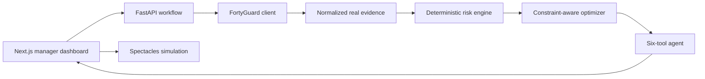

# HeatShift AI

**Operational heat decisions—not another weather map.**

HeatShift AI is a narrow industrial-safety vertical slice for HSE managers. It retrieves hyperlocal FortyGuard conditions for a fictional Phoenix logistics yard, calculates deterministic screening-level worker heat risk, moves flexible heavy work into cooler valid windows, and formats explainable alerts for a simulated smart-spectacles interface.

Primary submission track: **Industrial & Enterprise**. Agentic tool execution is the technical differentiator; the official safety calculations never depend on an LLM.

## Reproducible result

Across three completed real FortyGuard historical replays, HeatShift reduced worker-minutes at or above the configured screening threshold by **78.0%** (**3,690 → 810**) while retaining **100%** of scheduled task time. See [the complete evaluation](docs/evaluation.md) and [raw results](data/evaluation_results.json).

Separately, the existing screening policy was tested without fitting against
**566 measured HEAT-SHIELD human-exposure sessions**. Its score has a **0.7718
Spearman rank correlation** with measured one-hour physical work-capacity loss;
sessions at or above the product threshold averaged **36.45 percentage points
more loss** than sessions below it. See the [empirical benchmark](docs/real-data-validation.md).

The demo scenario contains one fictional operation, three fictional crews (12 workers), and six tasks. The FortyGuard responses and activity IDs are real.

## What works

- Real FortyGuard heatmap: 198 Phoenix grid cells at 100 m granularity.
- Real FortyGuard environmental series: 11 hourly apparent-temperature, heat-index, humidity, wet-bulb, and solar observations.
- Explicit live → saved-real-response → failure data strategy; no generated weather.
- Policy-file-driven 0–100 screening score with factor evidence.
- Deterministic greedy scheduler that preserves fixed work, dependencies, duration, shift bounds, and crew availability.
- One-call demo plus create/poll FastAPI workflow.
- Six-tool orchestration trace with a free hosted Groq model in deployment, provider-configurable
  Responses access for local testing, and a deterministic fallback.
- MapLibre map plus a GPU-independent real-GeoJSON renderer.
- Before/after schedule, manager recommendations, evidence drawer, and interactive spectacles HUD.
- Three-replay offline evaluation and automated backend/frontend checks.
- Reproducible CC BY 4.0 human-trial benchmark with integrity hashes and public metrics API.

## Quick start

Prerequisites: Python 3.11+ and Node.js 20+.

```bash
python3 -m venv .venv
source .venv/bin/activate
pip install -r backend/requirements.txt
cp .env.example .env
PYTHONPATH=backend uvicorn app.main:app --reload --port 8000
```

In another terminal:

```bash
cd frontend
npm ci
NEXT_PUBLIC_API_BASE_URL=http://localhost:8000 npm run dev
```

Open `http://localhost:3000`. The default `FORTYGUARD_MODE=cached` uses labelled responses captured from successful real API activities, so the demo is reliable and consumes no credits.

To call FortyGuard live at runtime:

```bash
export FORTYGUARD_API_KEY="..."
export FORTYGUARD_MODE=live
```

Live mode submits a heatmap and environmental activity, polls both with bounded backoff, and falls back to the labelled saved real response if the service fails. Credentials stay server-side.

## Architecture



The separation is deliberate: FortyGuard supplies evidence; the risk engine and optimizer produce the official result; the agent orchestrates and explains; the UI exposes every important assumption and activity ID.

## API

| Method | Path | Purpose |
|---|---|---|
| `GET` | `/health` | Backend, FortyGuard, cache, and optional LLM state |
| `POST` | `/api/demo` | Run the complete Phoenix replay and agent trace |
| `POST` | `/api/analyses` | Run and return a completed job for the bundled single-site analysis |
| `GET` | `/api/analyses/{id}` | Retrieve a job; deterministically reconstruct valid IDs after a serverless cold start |
| `POST` | `/api/analyses/{id}/agent` | Re-run the auditable agent briefing |
| `GET` | `/api/demo/scenario` | Inspect the fictional site, crews, and shift |
| `GET` | `/api/validation/heatshield` | Inspect the real HEAT-SHIELD benchmark, measured metrics, provenance, and limitations |

Interactive OpenAPI documentation is available at `/docs`.

For an independent review that starts with the problem and scenario, separates
real evidence from simulated inputs, reproduces the calculations, and provides
a complete pass/fail protocol, use the
[third-party evaluator handbook](docs/third-party-evaluator-guide.md).
The stricter [claim-validation suite](docs/claim-validation-suite.md) adds a
standard-library oracle, randomized differential checks, mutation checks,
deployed determinism testing, and an explicit external-provenance trust tier.

## Data provenance

The main replay uses:

- Heatmap activity: `81e55f4d-b51b-4dcc-bd4f-ab4e6c527002`
- Environmental activity: `eb97f401-3e22-44e1-a537-a86a0aa912db`
- Heatmap time: August 28, 2026 at 15:00 GMT−7
- Environmental range: August 28, 2026 from 06:00–16:00 GMT−7

Two additional pairs of completed real activity IDs are retained in `data/evaluation_results.json`. The client follows FortyGuard's official [`POST /v1/heatmap`](https://docs-api.fortyguard.com/docs/create-heatmap), [`POST /v1/env_params`](https://docs-api.fortyguard.com/docs/environmental-parameters), and [`GET /v1/status/{activity_id}`](https://docs-api.fortyguard.com/docs/check-status) flow.

The separate empirical benchmark uses the public, CC BY 4.0
[HEAT-SHIELD individual-session dataset](https://doi.org/10.6084/m9.figshare.25722300.v1).
The checked-in 566-row derived slice has a recorded SHA-256 and can be rebuilt
from the original workbook with `scripts/prepare_heatshield_validation.py`.

## Screening methodology

The environmental component uses FortyGuard's returned **apparent-temperature time series**. Workload, PPE burden, acclimatization, shade, and configured solar hours add deterministic points. All thresholds live in [`data/demo/policy_rules.json`](data/demo/policy_rules.json), scores are clamped to 0–100, and every result includes its factors.

The optimizer evaluates 30-minute candidate starts and minimizes worker-weighted risk plus a schedule-disruption penalty. Fixed tasks never move. Full details are in [methodology.md](docs/methodology.md).

NIOSH guidance links are curated tool outputs, including [workplace recommendations](https://www.cdc.gov/niosh/heat-stress/recommendations/index.html) and [acclimatization guidance](https://www.cdc.gov/niosh/heat-stress/recommendations/acclimatization.html).

## Tests and evaluation

```bash
python3 -m pytest backend/tests -q
python3 scripts/run_claim_evaluation.py
python3 scripts/generate_evaluation.py
cd frontend && npm run lint && npm run build
```

The normal suite never calls FortyGuard. Live contract scripts are separate because completed activities consume credits:

```bash
python3 scripts/test_fortyguard_access.py
python3 scripts/fetch_fortyguard_environment.py
```

## Deployment

The hackathon deployment has a hard zero-cost constraint. Both projects use the
Vercel Hobby plan and generated `vercel.app` domains; no Render service, database,
paid monitoring product, or custom domain is required.

- Backend: import the repository into Vercel with the repository root as the project root. Vercel detects the root `main.py` as FastAPI. Set `LLM_API_KEY` to the Groq API key and keep `FORTYGUARD_MODE=cached`; `FORTYGUARD_API_KEY` is optional in cached mode.
- Frontend: import the same repository as a second Vercel project with `frontend/` as its root. Set `NEXT_PUBLIC_API_BASE_URL` to the backend origin, then add the frontend origin to the backend's `CORS_ORIGINS`.
- Backend defaults select Groq's Responses endpoint and free-plan `qwen/qwen3.6-27b` model, which supports parallel tool orchestration. If its rate limit is exhausted, the deterministic fallback still returns the official result.
- Live FortyGuard mode is an explicit demo-only option because it can consume API credits; the public default replays labelled responses from successful real activities.
- The create endpoint completes within one request. Its in-memory cache is only an acceleration layer; valid job IDs are reconstructed from the deterministic replay if a later request reaches a fresh Vercel instance.

Vercel Hobby is free but limited to personal, non-commercial use. This is a public
hackathon demo deployment, not a commercial production hosting commitment. See
[`docs/zero-cost-stack.md`](docs/zero-cost-stack.md) for the complete cost guardrails.

The LLM connection is server-configurable through `LLM_PROVIDER`, `LLM_BASE_URL`,
`LLM_API_KEY`, and `LLM_MODEL`. OmniRoute is accepted only as an explicit local test
override; the public backend never depends on a localhost service. End-user API-key
storage is intentionally excluded because this slice has no authentication or encrypted
secret store.

Run the smoke checklist in [demo-script.md](docs/demo-script.md) after both URLs are public.
The deployed backend is `https://heatshift-ai-api.vercel.app`; run
`python3 scripts/smoke_public_api.py` for its complete public contract or follow
the endpoint-by-endpoint [API testing guide](docs/api-testing.md).

## Safety limitation

> HeatShift provides screening-level decision support using ambient and environmental data. It does not replace an on-site WBGT meter, emergency procedures, or a qualified safety professional. Product risk bands are not medical diagnoses or regulatory exposure limits.

## Repository map

```text
backend/     FastAPI, FortyGuard client, models, services, agent, tests
frontend/    Next.js dashboard, MapLibre/SVG map, timeline, evidence, HUD
data/        fictional demo inputs, real evidence, validation slice, evaluation
scripts/     live capability checks and reproducible evaluation
docs/        architecture, methodology, evaluation, demo, submission copy
```

Licensed under the MIT License.
