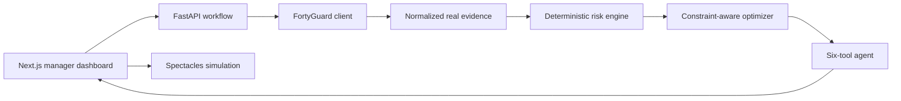

# HeatShift AI

**Operational heat decisions—not another weather map.**

HeatShift AI is a narrow industrial-safety vertical slice for HSE managers. It retrieves hyperlocal FortyGuard conditions for a fictional Phoenix logistics yard, calculates deterministic screening-level worker heat risk, moves flexible heavy work into cooler valid windows, and formats explainable alerts for a simulated smart-spectacles interface.

Primary submission track: **Industrial & Enterprise**. Agentic tool execution is the technical differentiator; the official safety calculations never depend on an LLM.

## Reproducible result

Across three completed real FortyGuard historical replays, HeatShift reduced worker-minutes at or above the configured screening threshold by **78.0%** (**3,690 → 810**) while retaining **100%** of scheduled task time. See [the complete evaluation](docs/evaluation.md) and [raw results](data/evaluation_results.json).

The demo scenario contains one fictional operation, three fictional crews (12 workers), and six tasks. The FortyGuard responses and activity IDs are real.

## What works

- Real FortyGuard heatmap: 198 Phoenix grid cells at 100 m granularity.
- Real FortyGuard environmental series: 11 hourly apparent-temperature, heat-index, humidity, wet-bulb, and solar observations.
- Explicit live → saved-real-response → failure data strategy; no generated weather.
- Policy-file-driven 0–100 screening score with factor evidence.
- Deterministic greedy scheduler that preserves fixed work, dependencies, duration, shift bounds, and crew availability.
- One-call demo plus create/poll FastAPI workflow.
- Six-tool orchestration trace with a free hosted Groq model in deployment, provider-configurable
  Responses access for local testing, and a deterministic fallback.
- MapLibre map plus a GPU-independent real-GeoJSON renderer.
- Before/after schedule, manager recommendations, evidence drawer, and interactive spectacles HUD.
- Three-replay offline evaluation and automated backend/frontend checks.

## Quick start

Prerequisites: Python 3.11+ and Node.js 20+.

```bash
python3 -m venv .venv
source .venv/bin/activate
pip install -r backend/requirements.txt
cp .env.example .env
PYTHONPATH=backend uvicorn app.main:app --reload --port 8000
```

In another terminal:

```bash
cd frontend
npm ci
NEXT_PUBLIC_API_BASE_URL=http://localhost:8000 npm run dev
```

Open `http://localhost:3000`. The default `FORTYGUARD_MODE=cached` uses labelled responses captured from successful real API activities, so the demo is reliable and consumes no credits.

To call FortyGuard live at runtime:

```bash
export FORTYGUARD_API_KEY="..."
export FORTYGUARD_MODE=live
```

Live mode submits a heatmap and environmental activity, polls both with bounded backoff, and falls back to the labelled saved real response if the service fails. Credentials stay server-side.

## Architecture



The separation is deliberate: FortyGuard supplies evidence; the risk engine and optimizer produce the official result; the agent orchestrates and explains; the UI exposes every important assumption and activity ID.

## API

| Method | Path | Purpose |
|---|---|---|
| `GET` | `/health` | Backend, FortyGuard, cache, and optional LLM state |
| `POST` | `/api/demo` | Run the complete Phoenix replay and agent trace |
| `POST` | `/api/analyses` | Queue the supported single-site analysis |
| `GET` | `/api/analyses/{id}` | Poll `queued → fetching_heat → calculating_risk → optimizing → completed/failed` |
| `POST` | `/api/analyses/{id}/agent` | Re-run the auditable agent briefing |
| `GET` | `/api/demo/scenario` | Inspect the fictional site, crews, and shift |

Interactive OpenAPI documentation is available at `/docs`.

## Data provenance

The main replay uses:

- Heatmap activity: `81e55f4d-b51b-4dcc-bd4f-ab4e6c527002`
- Environmental activity: `eb97f401-3e22-44e1-a537-a86a0aa912db`
- Heatmap time: August 28, 2026 at 15:00 GMT−7
- Environmental range: August 28, 2026 from 06:00–16:00 GMT−7

Two additional pairs of completed real activity IDs are retained in `data/evaluation_results.json`. The client follows FortyGuard's official [`POST /v1/heatmap`](https://docs-api.fortyguard.com/docs/create-heatmap), [`POST /v1/env_params`](https://docs-api.fortyguard.com/docs/environmental-parameters), and [`GET /v1/status/{activity_id}`](https://docs-api.fortyguard.com/docs/check-status) flow.

## Screening methodology

The environmental component uses FortyGuard's returned **apparent-temperature time series**. Workload, PPE burden, acclimatization, shade, and configured solar hours add deterministic points. All thresholds live in [`data/demo/policy_rules.json`](data/demo/policy_rules.json), scores are clamped to 0–100, and every result includes its factors.

The optimizer evaluates 30-minute candidate starts and minimizes worker-weighted risk plus a schedule-disruption penalty. Fixed tasks never move. Full details are in [methodology.md](docs/methodology.md).

NIOSH guidance links are curated tool outputs, including [workplace recommendations](https://www.cdc.gov/niosh/heat-stress/recommendations/index.html) and [acclimatization guidance](https://www.cdc.gov/niosh/heat-stress/recommendations/acclimatization.html).

## Tests and evaluation

```bash
python3 -m pytest backend/tests -q
python3 scripts/generate_evaluation.py
cd frontend && npm run lint && npm run build
```

The normal suite never calls FortyGuard. Live contract scripts are separate because completed activities consume credits:

```bash
python3 scripts/test_fortyguard_access.py
python3 scripts/fetch_fortyguard_environment.py
```

## Deployment

- Backend: deploy the repository with `render.yaml`; set `FORTYGUARD_API_KEY`, the deployed frontend in `CORS_ORIGINS`, and `LLM_API_KEY` to a Groq API key. The Blueprint selects Groq's Responses endpoint and the free-plan `openai/gpt-oss-120b` model.
- Frontend: deploy `frontend/` to Vercel; set `NEXT_PUBLIC_API_BASE_URL` to the backend origin.
- Keep `FORTYGUARD_MODE=cached` for a stable judging demo or use `live` to demonstrate runtime retrieval with the saved-response fallback.

The LLM connection is server-configurable through `LLM_PROVIDER`, `LLM_BASE_URL`,
`LLM_API_KEY`, and `LLM_MODEL`. OmniRoute is accepted only as an explicit local test
override; the public backend never depends on a localhost service. End-user API-key
storage is intentionally excluded because this slice has no authentication or encrypted
secret store.

Run the smoke checklist in [demo-script.md](docs/demo-script.md) after both URLs are public.

## Safety limitation

> HeatShift provides screening-level decision support using ambient and environmental data. It does not replace an on-site WBGT meter, emergency procedures, or a qualified safety professional. Product risk bands are not medical diagnoses or regulatory exposure limits.

## Repository map

```text
backend/     FastAPI, FortyGuard client, models, services, agent, tests
frontend/    Next.js dashboard, MapLibre/SVG map, timeline, evidence, HUD
data/        fictional demo inputs, policy, saved real responses, evaluation
scripts/     live capability checks and reproducible evaluation
docs/        architecture, methodology, evaluation, demo, submission copy
```

Licensed under the MIT License.
