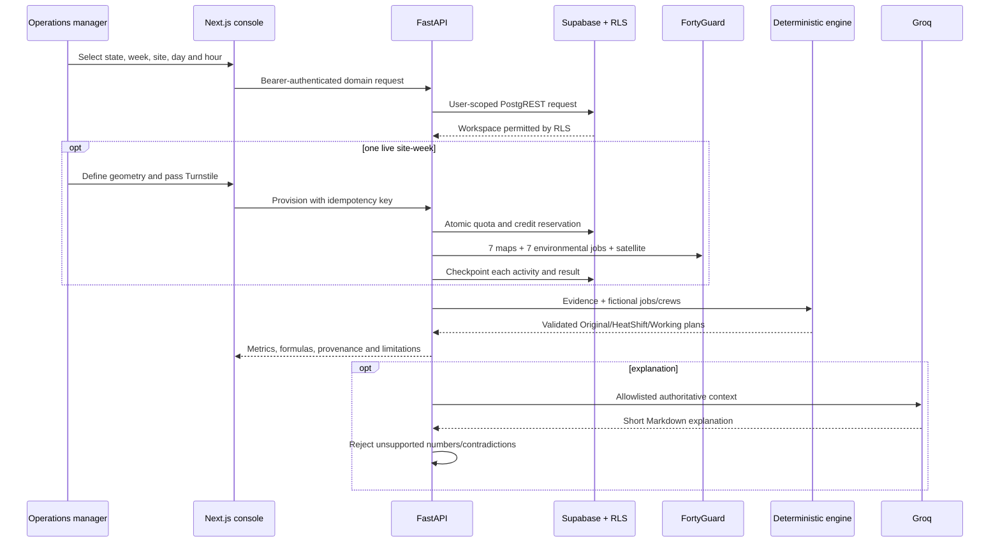

# Weekly product architecture

## System flow

## Trust boundaries

| Layer | Authority | Explicit prohibition |
|---|---|---|
| FortyGuard | Environmental provider payloads and activity IDs | Does not define jobs, crews, risk policy, or schedules |
| Supabase | Anonymous identity and row ownership through RLS | Service role is never exposed to the browser |
| FastAPI | Domain validation, orchestration, quota, persistence adapter | Rejects untrusted browser scores, durations, and ownership claims |
| Deterministic engine | Screening scores, metrics, constraint validation and proposals | Does not call an LLM; does not claim global optimality |
| Groq | Concise grounded explanation | Cannot change a schedule or official metric |
| Next.js | Interaction, map, timeline, inspector, session-only Q&A history | Does not hold provider, Turnstile secret, or Supabase service key |

## Persistence

Supabase anonymous sign-in creates a user identity without a login screen. Every exposed table has RLS. The browser sends its bearer token to FastAPI; FastAPI forwards that token for user-scoped database access. Curated environmental evidence is shared and immutable. Editing a curated operation stores a private operational overlay; it does not copy or mutate the environmental evidence.

The current adapter serializes the domain aggregate in `workspaces.domain_snapshot` while the migration also defines normalized tables for sites, days, crews, jobs, dependencies, plan versions, entries, analyses, provisioning, and quota. This preserves one authoritative RLS boundary while the domain model evolves.

Local testing may use `x-heatshift-workspace`; Vercel defaults this adapter off and fails closed unless Supabase JWT verification is configured.

## Provider state machine

1. Validate JWT, Turnstile action/hostname/token, state, US containment, area, historical week, user quota, usage and global reserve.
2. Compute the canonical request hash. A complete validated cached result can be reused without another provider call while still consuming that anonymous workspace's one-site allowance.
3. Claim a server-only atomic reservation RPC. Active hashes are unique, so concurrent identical requests cannot double-spend credits; one owner can hold one live allocation.
4. Submit daily 15:00 100m heatmaps and immediately persist activity IDs.
5. Poll in short idempotent advances; persist each completed result.
6. Submit each environmental job only after that day’s heatmap yields a mean.
7. Submit satellite segmentation once.
8. Normalize, validate all seven dates, 24 hourly conditions per day, non-empty cells and all 15 activity IDs, then store the server-only request cache and mark `ready`, `degraded`, or `failed`.
9. Release the reservation. Retries process only missing/failed stages.

The estimated 64,240 credits per site-week and 200,000-credit reserve are safety configuration, not a provider billing guarantee.

## Maps and failure behavior

MapLibre uses the free OpenFreeMap vector style for pan, zoom, buildings, clustered portfolio sites, job markers, crews, cells and site boundaries. Any WebGL initialization or early tile/style failure switches to the checked-in US state GeoJSON and a fully functional SVG thermal renderer. Map-created geometry is revalidated server-side; the browser is never the authority for state containment or the 10 mi² cap.

When the selected week does not match a site’s evidence, the API returns no environmental days and the UI says “No evidence for the selected week.” It never reuses evidence from another time or location.

## Data classification

- Real: provider outputs, activity IDs and integrity hashes.
- Fictional: operations, people, logistics, jobs, zones and statuses.
- Derived: hourly spatial reconstruction, buildings estimates, scores, metrics and schedules.

Building context is a HeatShift estimate derived from nearby/intersecting provider cells, not a building or indoor sensor reading.

The exact curated hashes and provider activity IDs are pinned in `claim_evaluation/evidence_manifest.json`. Two environmental activities remained indefinitely in provider `Processing`; their IDs are retained there as abandoned, and separately submitted completed replacements are the authoritative cached inputs.
