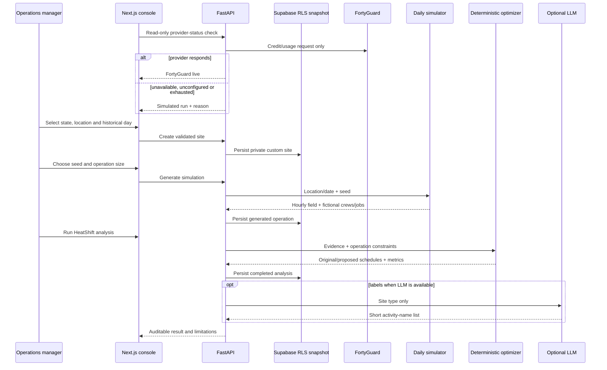

# Daily product architecture

## System flow

## Trust boundaries

| Layer | Authority | Explicit limitation |
|---|---|---|
| FortyGuard | Availability response and cached provider evidence | Current custom-site daily flow does not acquire new provider weather |
| Daily simulator | Clearly labelled custom-site environmental profile and fictional operation | Never presented as observed historical conditions |
| FastAPI | Identity, geometry/date validation, simulation orchestration and analysis | Persists authenticated custom workspace snapshots after every mutation |
| Deterministic engine | Scores, metrics, constraints and proposal | No LLM call; no global-optimum claim |
| Optional LLM | Short activity labels | Cannot change evidence, scores, schedules or metrics |
| Next.js | Map, hour controls, result panels, guide and provider state | Holds no provider or database secret |

## Provider availability state

`GET /api/daily/provider-status` requires the same anonymous workspace identity as other daily routes. The backend performs the provider’s read-only credit/usage request and caches the result for five minutes.

States:

- `available`: provider responded; header says FortyGuard live.
- `provider_unavailable`: request failed securely; header says Simulated run.
- `credits_exhausted`: remaining credits are zero or lower; header says Simulated run.
- `not_configured`: no provider key; header says Simulated run.

The Retry button calls the route with `refresh=true`, bypassing the cache. Failure preserves fallback. Success exits fallback. The check never creates provider work, never consumes analysis credits and never disables certificate verification.

## Curated and custom data

At backend startup, Phoenix, Houston and Miami daily records are reconstructed from checked-in curated site-week files. Each record selects one exact historical day, then generates its fictional operation with a fixed seed and runs the deterministic analyzer.

A custom site is validated against:

- supported state/DC catalog;
- exact state boundary containment;
- positive area no greater than 10 mi²;
- historical date from January 1, 2019 through today;
- valid IANA timezone.

Custom evidence uses a disclosed simulation based on season, latitude, broad regional heat/humidity behavior, longitude and seed. It creates 24 hourly conditions and 63 100 m heat cells.

## Map architecture

The product uses Leaflet with OpenStreetMap tiles and GeoJSON overlays. Site boundaries, heat cells and work markers remain standard DOM/SVG layers, so the core map does not require WebGL. State view and site detail are one continuous map rather than separate portfolio/site screens.

The per-state temperature legend is fixed across the day. Within each selected hour, cell shading preserves small spatial differences and clicking a cell exposes its exact derived value and active jobs.

## Persistence

Supabase anonymous authentication protects hosted daily routes when configured. Local development may use `x-heatshift-workspace` only while `HEATSHIFT_LOCAL_AUTH=true`; Vercel must set it false.

For authenticated users, FastAPI stores only private daily operational state in the RLS-protected `workspaces.domain_snapshot` column. Every authenticated request treats that snapshot as authoritative, reconstructs the three curated defaults from the repository, then overlays the user's custom sites, simulated evidence, crews, jobs and completed analyses. This prevents one warm Vercel instance from serving an older in-memory copy after another instance handles a mutation. Every create, generate, analyze, delete and reset mutation saves the new snapshot before returning. Local development without Supabase intentionally remains process-local.

## Deployment

The repository contains two linked Vercel projects:

- root FastAPI project: `heatshift-ai-api.vercel.app`;
- `frontend/` Next.js project: `heatshift-ai-zeta.vercel.app`.

Frontend public variables point to the deployed API. Backend secrets remain only in the API project.
