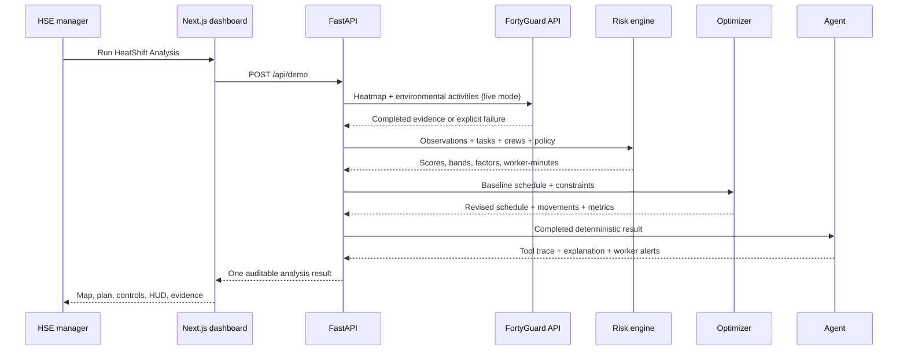

# Architecture

HeatShift is intentionally a narrow vertical slice. Each layer owns one kind of truth.

## Trust boundaries

| Component | May do | Must not do |
|---|---|---|
| FortyGuard client | Authenticate, validate, submit, poll, normalize, label, cache completed real responses | Generate synthetic environmental evidence |
| Risk engine | Read the versioned policy, calculate the official score, expose factors | Call an LLM or invent missing apparent temperature |
| Optimizer | Search valid 30-minute starts and verify constraints | Change duration, move fixed work, overlap a crew, violate dependencies |
| Agent | Call validated tools, preserve model outputs, explain deterministic evidence | Calculate or alter the official score, invent a tool result |
| Frontend | Present provenance, evidence, limitations, and local HUD interactions | Receive or expose server API keys |

## Failure behavior

1. Live FortyGuard is attempted only when `FORTYGUARD_MODE=live`.
2. A live error falls back to a labelled saved response captured from completed real activities.
3. If neither live nor saved real evidence is available, the analysis fails explicitly.
4. If the LLM is unavailable, the same six validated tools run in a deterministic fallback sequence.
5. If WebGL2 is unavailable, the map renders all real GeoJSON cells, task points, and the cooling zone as SVG.
6. The schedule and metrics remain available if third-party map tiles fail.

The in-memory analysis store is sufficient for the hackathon: a backend restart loses job IDs, but `POST /api/demo` reproduces the result from the saved evidence.

