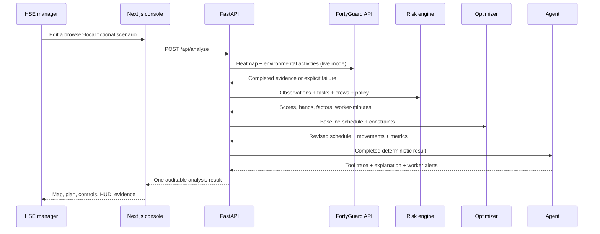

# Architecture

HeatShift is intentionally a narrow vertical slice. Each layer owns one kind of truth.

## Trust boundaries

| Component | May do | Must not do |
|---|---|---|
| FortyGuard client | Authenticate, validate, submit, poll, normalize, label, cache completed real responses | Generate synthetic environmental evidence |
| Risk engine | Read the versioned policy, calculate the official score, expose factors | Call an LLM or invent missing apparent temperature |
| Optimizer | Search valid 30-minute starts and verify constraints | Change duration, move fixed work, overlap a crew, violate dependencies |
| Agent | Call validated tools, preserve model outputs, explain deterministic evidence | Calculate or alter the official score, invent a tool result |
| Frontend | Present the empirical homepage; store editable fictional scenarios locally; submit validated scenario JSON; present provenance, evidence, limitations, and local HUD interactions | Receive or expose server API keys; claim browser-local state is a durable audit record |

The visible agent card is intentionally downstream of the official result. It
shows the execution mode and successful tool count, places the explanation in a
larger dedicated reading surface, and states that deterministic fields—not the
LLM prose—are authoritative.

## Failure behavior

1. Live FortyGuard is attempted only when `FORTYGUARD_MODE=live`.
2. A live error falls back to a labelled saved response captured from completed real activities.
3. If neither live nor saved real evidence is available, the analysis fails explicitly.
4. If the LLM is unavailable, the same six validated tools run in a deterministic fallback sequence.
5. The map always renders all real GeoJSON cells, task points, site boundary,
   and cooling zone as SVG. It does not depend on WebGL or third-party map tiles.
6. Editing a scenario invalidates the previous result until the user explicitly
   runs the analysis again.

The backend remains stateless for user scenarios: `POST /api/analyze` returns a
complete result but does not retain the request. The console persists the latest
scenario in that browser's local storage and supports JSON import/export. The
legacy job-shaped demo workflow has an in-memory acceleration cache and can
reconstruct valid IDs from the deterministic reference replay after a cold start.

The complete regression layers and browser-local CRUD boundary are documented
in [testing.md](testing.md).
