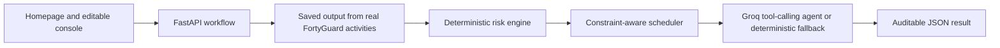

# HeatShift AI — independent evaluator handbook

This handbook is for someone who has never seen HeatShift AI, does not know the
heat-safety domain, and wants to test the current public product thoroughly.
It explains the problem, the product, the scenario, which facts are real or
fictional, how the result is calculated, and exactly what should pass or fail.

## Start here

The current test targets are the deployed dashboard and backend API:

- Production homepage: <https://heatshift-ai-zeta.vercel.app>
- Interactive console: <https://heatshift-ai-zeta.vercel.app/console>
- Production API: <https://heatshift-ai-api.vercel.app>
- Interactive Swagger tester: <https://heatshift-ai-api.vercel.app/docs>
- Machine-readable OpenAPI schema: <https://heatshift-ai-api.vercel.app/openapi.json>
- Source repository: <https://github.com/SilentKnight742/heatshift-ai>

You need only a web browser for the basic test. `curl`, Git, and Python 3 are
useful for the deeper tests. You do **not** need a HeatShift account, a GitHub
account, a Groq key, or a FortyGuard key.

The homepage is the primary judge-facing product story, and the console is the
interactive product. The API, source, claim oracle, and raw evidence remain
available for deeper independent verification. The console automatically runs
the reference analysis; a first serverless or model cold start may take several
seconds.

Allow up to 150 seconds for an analysis request before declaring it timed out.
Most requests are much faster, but the free hosted model and serverless cold
starts can vary.

## Judge-oriented product overview

### One-sentence pitch

HeatShift AI turns heat evidence and a planned work shift into an explainable,
constraint-safe recommendation about **which flexible tasks should move, when
they should move, what cannot move, and what residual risk still needs human
control**.

It is not another weather application. A weather application answers “how hot
will it be?” HeatShift answers a narrower operational question: “given this
site, these crews, this work, and these constraints, what can a safety manager
change before the shift starts?”

### What FortyGuard is

FortyGuard is the external environmental-data provider used by this prototype.
It supplies a hyperlocal thermal map and environmental parameters for a real
geographic area. A judge does not need a FortyGuard account or knowledge of its
API. In product terms, FortyGuard is the **evidence layer**: it describes the
thermal environment, but it does not know HeatShift's crews, task durations,
PPE, workload, dependencies, or which work is movable.

HeatShift adds that operational context, calculates its transparent screening
policy, searches valid schedule changes, preserves constraints, and presents the
result with source IDs and limitations. The public deployment uses labelled
saved responses from completed real activities so evaluation is reliable and
free; a future operator could select live mode.

### Who this is for

| Audience | Their practical question | What HeatShift gives them |
|---|---|---|
| HSE/EHS manager or site safety lead | “Where is the heat burden, which work is most concerning, and what should I change?” | Site evidence, factor-level screening scores, before/after exposure, recommendations, residual-risk escalation, and an audit trail |
| Operations manager, dispatcher, or shift planner | “Can we reduce exposure without cancelling work or breaking the plan?” | Constraint-safe task movements that preserve crews, duration, fixed work, dependencies, and allowed windows |
| Crew supervisor or foreperson | “What changes do I need to communicate before or during the shift?” | A concise optimized plan, reasons for each change, fixed-work warnings, and worker-facing alerts |
| Worker | “What should I do now, and whom should I contact?” | A future simple alert or wearable view with timing, location, severity, hydration/recovery reminder, and acknowledgement—not the full management dashboard |
| Regional safety director or employer | “Can I compare sites and document why a decision was made?” | A future portfolio view, trend metrics, evidence provenance, policy versioning, and decision history |
| Hackathon judge, auditor, or researcher | “Are the result and AI behavior real, reproducible, and honestly scoped?” | Raw evidence, exact arithmetic, independent tests, agent trace, empirical benchmark, and explicit fictional/real boundaries |

The strongest early users are organizations with outdoor or semi-outdoor work
that can sometimes be rescheduled: construction, logistics yards, road and rail
maintenance, utilities, airports, municipal services, agriculture, mining, and
large outdoor facilities. HeatShift is less useful when every task is immovable
or when the organization is looking for a medical diagnosis rather than an
operational planning aid.

### What a successful product experience looks like

Before a shift, a manager selects or imports a site, crews, tasks, work windows,
dependencies, workload, PPE, shade, and acclimatization status. HeatShift adds
environmental evidence, highlights higher-priority work, proposes only legal
schedule changes, and shows the before/after consequence. The manager reviews,
edits, approves, or rejects the proposal. Approved changes then flow to crew
supervisors and workers, while unresolved fixed work remains visible for added
controls or escalation.

The current product performs that loop for the bundled reference scenario and
for browser-created fictional scenarios using the same operational fields. It
does not yet ingest live customer systems, retain scenarios on a server, or send
real notifications.

### What a judge should see on the frontend

The public frontend now has two deliberately separate surfaces:

1. **Homepage — evidence before demo.** The hero states the operational value,
   a diagram shows evidence + crew context + constraints flowing into the
   decision engine, and the empirical section shows 566 HEAT-SHIELD sessions,
   32 participants, 0.7718 rank correlation, 14.37% versus 50.82% measured
   one-hour work-capacity loss, and the 36.45-point difference. The nearby copy
   must preserve the descriptive, non-causal, non-medical boundary.
2. **Console — build and analyze.** A persistent left panel edits the fictional
   site, crews, tasks, workload, PPE, acclimatization, timing, dependencies,
   mobility, shade, and locations. The center shows the complete reference or
   custom result.
3. **Environmental evidence.** The console map must render the 198 real
   FortyGuard GeoJSON cells as SVG in every browser, plus the site boundary,
   tasks, cooling point, provider label, and hourly heat strip. WebGL is not
   required.
4. **Baseline and recommended plan.** The timeline and outcome cards show
   exactly what moved, what stayed fixed, 1,230 → 270 exposed worker-minutes and
   78.0% for the reference scenario, 100% task time retained, and residual
   alerts—not an unsupported “workers saved” number.
5. **Human review and trust.** Manager choices and HUD controls are explicitly
   local simulations. The evidence drawer exposes policy version, source IDs,
   agent trace, guidance, and limitations. The prominent **What the AI
   recommends** card identifies the execution mode and states that the AI only
   explains the validated deterministic result.

The visual language should say **screening score**, **worker-minutes at or above
the product threshold**, and **measured physical work-capacity loss**. It should
never relabel these as illness probability, injuries prevented, regulatory
compliance, or real Phoenix employees.

## 1. What problem are we trying to solve?

Outdoor work can become more hazardous as heat, humidity, sun exposure,
physical workload, protective clothing, and a worker's acclimatization burden
increase. A city-level forecast or a colorful heatmap is useful evidence, but
neither tells a Health, Safety and Environment (HSE) manager what can be changed
in an actual shift.

HeatShift AI tests a narrow operational idea:

> Can hyperlocal environmental evidence be combined with a crew-and-task plan
> to identify higher-risk work, move only the flexible tasks into cooler legal
> time windows, and explain the result without letting an LLM invent the safety
> calculation?

The project is not attempting to predict illness or replace workplace safety
procedures. It is a screening and prioritization demonstration.

## 2. What does HeatShift do?

For the bundled reference scenario—or an editable fictional operation using the
same Phoenix reference environment—the backend:

1. Loads a saved response from completed real FortyGuard activities.
2. Loads the reference logistics-yard shift or validates the submitted
   fictional site, crews, tasks, and constraints.
3. Calculates a deterministic 0–100 screening score for every task segment.
4. Counts worker-minutes at or above the configured score threshold of 50.
5. Searches valid 30-minute start times for the two movable heavy tasks.
6. Recalculates the shift and explains why each movement was chosen.
7. Generates manager recommendations and simulated worker alerts.
8. Runs six validated agent tools and returns their complete audit trace.

The output is one auditable JSON result containing the raw normalized evidence,
before-and-after schedules, factor-level scores, movements, metrics,
recommendations, worker alerts, provenance, limitations, and agent trace.



The separation is important. FortyGuard supplies environmental evidence. The
risk engine and scheduler own the official result. The LLM may orchestrate tools
and write an explanation, but it may not calculate or alter the official score.

## 3. What is real, fictional, derived, or simulated?

This is the most important truth table in the project.

| Item | Status | Meaning |
|---|---|---|
| Phoenix-area coordinates and area of interest | Real geography | FortyGuard processed an actual geographic polygon. It is not claimed to be the boundary of a real customer site. |
| FortyGuard heatmap and environmental payloads | Real provider outputs | They were saved from completed FortyGuard API activities, with activity IDs retained. Production replays them without spending credits. |
| DesertLine Logistics Yard | Fictional | The company/site name is invented for the demonstration. |
| Crew names, worker counts, PPE, and acclimatization | Fictional | No real employee or company data is used. |
| Tasks, timings, dependencies, and movable/fixed rules | Fictional | They form a controlled scheduling test case. |
| Policy v1.0.0 and its 0–100 bands | Product-defined | The rules are transparent and deterministic, but they are not medical or regulatory thresholds. |
| Risk scores and optimized schedule | Derived | The backend computes them from the real provider evidence plus the fictional operation and versioned product policy. |
| HEAT-SHIELD benchmark inputs and PWC-loss outcomes | Real research measurements | 566 controlled human-exposure sessions from a public CC BY 4.0 dataset; they are separate from the fictional Phoenix scenario. |
| HEAT-SHIELD benchmark metrics | Derived, descriptive | HeatShift applies its existing policy without fitting and reports correlations and group summaries, not illness predictions or causal effects. |
| Worker alerts and smart-spectacles view | Simulated | No physical wearable, push notification, or supervisor notification is connected. |
| NIOSH guidance links | Real guidance references | The agent returns curated official links; it does not perform open-web safety research at runtime. |
| LLM explanation | Generated or deterministic fallback | Its wording may vary. It cannot change the numbers returned by the deterministic engine. |

No synthetic weather is silently generated. In the public deployment,
`FORTYGUARD_MODE=cached` means “use a labelled saved response from a successful
real activity,” not “manufacture a fixture.” If neither live nor saved real
evidence is available, the workflow is designed to fail explicitly.

## 4. Domain terms in plain language

**Apparent temperature** is a provider-returned estimate of how conditions may
feel after environmental effects are considered. HeatShift uses FortyGuard's
hourly apparent-temperature array for the environmental part of its score.

**Heat index** is also returned as evidence, but it is not the same as WBGT.

**Wet-bulb temperature** is present in the provider payload. It must not be
mislabelled as workplace Wet Bulb Globe Temperature (WBGT).

**WBGT** is a workplace heat-stress measurement that accounts for multiple
thermal components. HeatShift does not claim its provider data is an on-site
WBGT measurement. A qualified safety lead and appropriate on-site measurement
remain necessary.

**Acclimatization** is the body's adaptation to working in heat. The scenario
distinguishes acclimatized, returning, and new crews.

**Worker-minute** means one worker exposed for one minute. For example, five
workers in a qualifying risk period for 120 minutes produce 600 exposed
worker-minutes. It is an exposure-volume metric, not an injury probability.

**Screening threshold** is the product's cutoff for prioritization. Here it is a
score of 50. It is not a legal exposure limit.

## 5. The scenario being simulated

### Site and shift

- Site: **DesertLine Logistics Yard** (fictional)
- Surface: paved logistics yard
- Time zone: `America/Phoenix` (UTC−07:00 on the replay)
- Shift: August 28, 2026, 06:00–16:00
- Geographic polygon: approximately 1.8 km² in the Phoenix area
- Cooling/recovery point: fictional Shade Zone B at longitude −112.0718,
  latitude 33.4504

### Crews

| Crew | Workers | Acclimatization | PPE burden | Default workload |
|---|---:|---|---|---|
| Alpha | 4 | Acclimatized | Medium | Moderate |
| Bravo | 5 | Returning | High | Heavy |
| Charlie | 3 | New | Medium | Light |

There are 12 fictional workers in total. “Returning” and “new” deliberately add
risk burden; this lets a tester see whether the engine is considering more than
temperature alone.

### Original six-task plan

| Task | Crew | Original time | Duration | Workload | Shade | May move? | Important constraint |
|---|---|---|---:|---|---|---|---|
| Vehicle inspection | Alpha | 06:00–07:00 | 60 min | Moderate | No | No | Fixed |
| Heavy cargo loading | Bravo | 13:00–15:00 | 120 min | Very heavy | No | Yes | Must remain between 06:00 and 16:00 |
| Asphalt repair | Alpha | 12:00–13:30 | 90 min | Heavy | No | Yes | Must follow vehicle inspection; allowed 07:00–16:00 |
| Equipment maintenance | Bravo | 08:30–10:00 | 90 min | Moderate | Yes | No | Fixed |
| Inventory scanning | Charlie | 10:00–11:30 | 90 min | Light | Yes | No | Fixed |
| Perimeter inspection | Charlie | 14:00–15:00 | 60 min | Moderate | No | No | Fixed |

The scenario is intentionally not solved by moving everything into the morning.
Four tasks are fixed. Two heavy tasks are flexible, but they must retain their
crew, duration, allowed window, and dependencies, and no crew may be assigned to
overlapping work.

## 6. The real FortyGuard evidence

### Main public replay

| Evidence | Value |
|---|---|
| Heatmap activity ID | `81e55f4d-b51b-4dcc-bd4f-ab4e6c527002` |
| Environmental activity ID | `eb97f401-3e22-44e1-a537-a86a0aa912db` |
| Heatmap request time | August 28, 2026 at 15:00 GMT−7 |
| Environmental range | August 28, 2026, 06:00–16:00 GMT−7 |
| Heatmap granularity | 100 metres |
| Heatmap cells | 198 non-empty GeoJSON polygons |
| Heatmap temperature range | 41.4473–41.5330°C |
| Heatmap mean | 41.5016303030°C |
| Hourly timestamps | 11 inclusive hourly observations |
| Apparent-temperature range | 33.0–45.3°C |
| Heatmap response captured | August 29, 2026 at 14:32:25 UTC |
| Environmental response captured | August 29, 2026 at 14:33:44 UTC |

The environmental result contains hourly arrays for apparent temperature, heat
index, relative humidity, wet-bulb temperature, precipitation, cloud cover, air
quality, and other parameters. HeatShift currently normalizes the parameters it
needs into 11 observations: apparent temperature, heat index, wet-bulb
temperature, relative humidity, and a clear-sky GHI summary.

There are two interpretation cautions:

1. FortyGuard's environmental request requires a temperature input. HeatShift
   supplied the heatmap mean of 41.5016303030°C. The application therefore does
   **not** present that input as an independently returned hourly ambient-
   temperature series.
2. The clear-sky GHI/DNI/DHI values are summaries for the requested time range,
   not 11 distinct hourly solar readings. The current risk policy uses the
   configured time-of-day solar adjustment, not GHI as an independent score.

The saved provider responses can be audited in
[`data/cache/fortyguard_demo_response.json`](../data/cache/fortyguard_demo_response.json)
and
[`data/cache/fortyguard_environment_response.json`](../data/cache/fortyguard_environment_response.json).
The public JSON result must repeat the two activity IDs and the cached mode.

### Three-replay evaluation

The same fictional crews, tasks, constraints, threshold, and policy were also
run against three pairs of completed real FortyGuard historical activities.

| Replay | Date | Heatmap / environmental activity IDs | Peak heatmap | Peak apparent | Baseline → optimized |
|---|---|---|---:|---:|---:|
| High heat | 2026-08-25 | `f186e5f4-89dd-4beb-a009-52dc414e0cf4` / `dac9f101-5a11-4d40-b444-bc5f2492c60f` | 42.0°C | 46.4°C | 1,230 → 270 |
| Afternoon hotspot | 2026-08-27 | `08a69f34-434c-4c8e-842a-108694fcafb5` / `f0f75867-c7e2-47de-9a29-4eb45ed5c35a` | 41.5°C | 46.1°C | 1,230 → 270 |
| Lower heat | 2026-08-28 | `81e55f4d-b51b-4dcc-bd4f-ab4e6c527002` / `eb97f401-3e22-44e1-a537-a86a0aa912db` | 41.5°C | 45.3°C | 1,230 → 270 |

Across these three controlled replays, exposed worker-minutes fall from 3,690 to
810, a 78.0% reduction, while all task durations are retained. This is a
repeatability demonstration for one operation, not a statistical safety study.
See the [evaluation report](evaluation.md) and
[`data/evaluation_results.json`](../data/evaluation_results.json).

## 6A. Separate real-outcome evidence: HEAT-SHIELD

The FortyGuard replays prove that HeatShift can process real environmental
evidence, but the operation and schedule are fictional. They therefore cannot
show whether a higher HeatShift score corresponds to a measured human outcome.
The HEAT-SHIELD benchmark answers that separate question.

### What the source contains

The public, CC BY 4.0
[HEAT-SHIELD dataset](https://doi.org/10.6084/m9.figshare.25722300.v1)
contains controlled human exercise sessions under varied temperature, humidity,
air movement, solar radiation, and clothing conditions. The outcome used here is
the source's measured percentage loss of one-hour physical work capacity (PWC)
relative to a thermoneutral reference. It is not heat illness, injury, or a
probability of harm.

HeatShift uses 566 individual sessions from 32 pseudonymous participants. Only
source studies 1–6 are selected because the workbook identifies them as the
complete one-hour modelling trials; later study IDs are duplicate subsets for
within-participant comparisons. The derived CSV is integrity-pinned and can be
rebuilt from the public workbook with
[`scripts/prepare_heatshield_validation.py`](../scripts/prepare_heatshield_validation.py).

Observed ranges include:

| Measurement | Minimum | Maximum |
|---|---:|---:|
| Air temperature | 14.311°C | 50.786°C |
| Relative humidity | 17.322% | 82.294% |
| Air speed | 0.019 m/s | 3.495 m/s |
| Apparent Temperature | 13.063°C | 62.149°C |
| Outdoor WBGT | 11.787°C | 40.821°C |
| UTCI | 14.964°C | 62.832°C |
| Measured PWC loss | 0.000% | 93.581% |

### What HeatShift tested

The existing policy was applied without fitting or changing its bands. Every
session used one standardized heavy-work, acclimatized profile. The source
coverall flag mapped to high versus low PPE burden, and its experimental solar
flag mapped to the existing direct-solar adjustment:

```text
score = points for source Apparent Temperature
      + 18 heavy-work points
      + 0 acclimatization points
      + 10 for source coverall, otherwise 0
      + 6 for source solar exposure, otherwise 0
```

The analysis asked whether higher fixed-policy scores occurred alongside greater
measured PWC loss, whether the product threshold separated sessions with
different measured outcomes, and how the coarse score compared with continuous
heat indices already present in the research data.

### Results

| Result | Value |
|---|---:|
| Score vs PWC loss, Pearson correlation | 0.7744 |
| Score vs PWC loss, Spearman rank correlation | 0.7718 |
| Environmental-points component vs PWC loss, Spearman | 0.8133 |
| Sessions below score 50 | 248 |
| Mean measured loss below score 50 | 14.37% |
| Sessions at/above score 50 | 318 |
| Mean measured loss at/above score 50 | 50.82% |
| Difference between threshold groups | 36.45 percentage points |

Band summaries are:

| Band | Sessions | Observed scores | Mean loss | Median | Middle 50% |
|---|---:|---:|---:|---:|---:|
| Moderate | 248 | 26–48 | 14.37% | 11.52% | 0.00–23.18% |
| High | 201 | 50–73 | 47.18% | 44.20% | 32.08–67.05% |
| Critical | 117 | 79–89 | 57.07% | 59.04% | 43.72–72.77% |

There are no low-band sessions because the standardized heavy-work addition
makes even the coolest records moderate. This is an expected profile property,
not missing data.

For comparison:

| Metric | Pearson | Spearman |
|---|---:|---:|
| HeatShift score | 0.7744 | 0.7718 |
| Apparent Temperature | 0.8425 | 0.8688 |
| Heat Index | 0.8612 | 0.8516 |
| Outdoor WBGT | 0.8263 | 0.8838 |
| UTCI | 0.8583 | 0.8732 |

This is useful but intentionally modest evidence. The HeatShift score is
strongly associated with measured work-capacity loss and its bands move in the
expected direction, but the continuous research indices correlate more strongly.
The result supports the score as an explainable prioritization signal; it does
not show that HeatShift outperforms established indices.

### Correct interpretation

Pearson measures linear association. Spearman measures whether higher values
generally rank with higher losses; 0.7718 does not mean “77.18% accurate.” The
36.45 percentage-point group difference is descriptive at HeatShift's
product-defined threshold, not proof that 50 is a medical or regulatory limit.

Participants contributed repeated sessions, so the 566 rows are not independent
people. HeatShift therefore reports descriptive statistics without causal
claims or inferential p-values. These are controlled laboratory trials, not a
prospective field evaluation, and PWC loss must never be rewritten as illness
probability or injuries prevented.

The complete method, provenance, candidate-source comparison, reproduction
steps, and display-safe claim language are in the
[empirical benchmark report](real-data-validation.md). The public aggregate
contract is `GET /api/validation/heatshield`.

## 7. How the deterministic screening score works

The rules live in
[`data/demo/policy_rules.json`](../data/demo/policy_rules.json), version 1.0.0.
They are deliberately readable and reviewable.

### Environmental points from apparent temperature

| Apparent temperature | Points |
|---|---:|
| ≤35°C | 8 |
| >35 to ≤38°C | 20 |
| >38 to ≤41°C | 32 |
| >41 to ≤44°C | 45 |
| >44°C | 55 |

### Adjustments

| Factor | Points |
|---|---:|
| Light / moderate / heavy / very heavy work | 0 / 8 / 18 / 25 |
| Low / medium / high PPE burden | 0 / 5 / 10 |
| Acclimatized / returning / new crew | 0 / 6 / 12 |
| Unshaded work from 10:00 up to, but not including, 16:00 | +6 |
| Shaded work | −5 |

The total is clamped to 0–100 and mapped to a product screening band:

| Score | Band |
|---:|---|
| 0–24 | Low |
| 25–49 | Moderate |
| 50–74 | High |
| 75–100 | Critical |

Each task is split into 30-minute segments. The nearest hourly observation is
used for each segment. The task response contains average score, peak score,
peak band, exposed worker-minutes, and the factors from the peak segment.
Missing apparent temperature causes an explicit scoring error; it is not
silently invented or imputed. Provider `null` and `-999` sentinels normalize to
missing.

Example: baseline heavy cargo loading reaches an unclamped score of 102:

```text
55 environmental
+ 25 very-heavy workload
+  6 returning crew
+ 10 high PPE burden
+  6 direct solar exposure
= 102, clamped to 100 (critical)
```

This traceability is a core acceptance requirement. An LLM-generated score with
no matching factors would be a serious defect.

## 8. How the exposure result is reproduced

For every 30-minute segment with score ≥50:

```text
exposed worker-minutes = segment minutes × crew worker count
```

The main replay's baseline total is:

| Qualifying task | Calculation | Worker-minutes |
|---|---:|---:|
| Inventory scanning | 30 qualifying min × 3 workers | 90 |
| Asphalt repair | 90 min × 4 workers | 360 |
| Heavy cargo loading | 120 min × 5 workers | 600 |
| Perimeter inspection | 60 min × 3 workers | 180 |
| **Total** |  | **1,230** |

After optimization, cargo loading and asphalt repair fall below 50. The two
fixed Charlie Crew tasks still contribute 90 + 180 = **270 worker-minutes**.

```text
reduction = (1,230 − 270) / 1,230 × 100 = 78.0%
```

The optimizer does not hide the residual risk. It returns recommendations and
worker alerts for the fixed work that remains above the threshold.

## 9. How the schedule optimizer works

The scheduler is deterministic and greedy rather than LLM-driven:

1. Rank movable tasks from highest to lowest workload.
2. Generate every allowable start in 30-minute steps.
3. Reject starts that exceed the task window, overlap the same crew, or break a
   dependency.
4. For every valid candidate, calculate worker-weighted screening risk plus a
   disruption penalty of 1.5 per minute moved from the original start.
5. Choose the lowest objective and validate the entire final schedule again.

Expected movements on the main replay:

| Task | Original | Optimized | Moved | Peak score change |
|---|---|---|---:|---|
| Heavy cargo loading | 13:00–15:00 | 06:30–08:30 | 390 min | 100 critical → 49 moderate |
| Asphalt repair | 12:00–13:30 | 07:30–09:00 | 270 min | 84 critical → 31 moderate |

The 660-minute disruption metric is the sum of the absolute movement of both
task start times. It is not lost labor. Productivity retained is 100% because
all six tasks and every scheduled task-minute remain in the plan.

The output must also prove that:

- vehicle inspection, equipment maintenance, inventory scanning, and perimeter
  inspection did not move;
- asphalt repair still starts after vehicle inspection ends;
- Bravo Crew's cargo loading ends exactly when its fixed maintenance begins;
- Alpha Crew's tasks do not overlap;
- every task keeps its original crew and duration; and
- every task stays within its permitted window.

## 10. What the AI agent actually does

The production backend is configured for Groq's Responses-compatible API and a
free hosted `qwen/qwen3.6-27b` model. The model must call these six validated
tools:

1. `get_site_heat`
2. `load_shift_plan`
3. `calculate_exposure_risk`
4. `optimize_shift`
5. `get_policy_guidance`
6. `create_worker_alerts`

Each tool accepts only an `analysis_id`. Arguments are validated, and the trace
records sequence, tool name, arguments, latency, success, and a summary. The
model receives already-computed deterministic results through those tools.

Two agent modes are valid:

- `llm_tool_calling`: the hosted model called all tools and wrote the briefing;
- `deterministic_fallback`: the model was unavailable, slow, or free-tier
  rate-limited, so the server ran the same six validated tools in a fixed order
  and wrote a fixed briefing.

Both modes must return six successful tools and the same official metrics. The
wording and tool latencies may vary. The fallback is a resilience feature, not
evidence that the risk engine failed.

The agent evidence list must reference both FortyGuard activity IDs, policy
version 1.0.0, and the official NIOSH workplace heat-stress and acclimatization
guidance links.

## 11. Current API service catalog

| Method | Path | Expected status | Purpose |
|---|---|---:|---|
| `GET` | `/` | 200 | Service discovery and links |
| `GET` | `/health` | 200 | Readiness and dependency configuration without calling providers |
| `GET` | `/docs` | 200 | Interactive Swagger UI |
| `GET` | `/openapi.json` | 200 | OpenAPI 3 contract |
| `GET` | `/api/demo/scenario` | 200 | Fictional site, crews, and original shift; no provider or LLM call |
| `GET` | `/api/validation/heatshield` | 200 | Real-data benchmark, provenance, measured PWC-loss metrics, assumptions, and limitations; no provider or LLM call |
| `POST` | `/api/demo` | 200 | Complete replay, optimization, recommendations, alerts, and agent trace |
| `POST` | `/api/analyze` | 200 or 422 | Analyze a validated fictional operation against the pinned Phoenix reference environment; the backend does not retain it |
| `POST` | `/api/analyses` | 201 | Create and synchronously complete the bundled analysis; body must be empty or `{}` |
| `GET` | `/api/analyses/{analysis_id}` | 200 or 404 | Retrieve a job; valid UUIDs can be replayed after a cold start |
| `POST` | `/api/analyses/{analysis_id}/agent` | 200 | Re-run the agent briefing for the deterministic result |

The create endpoint returns a completed job rather than a queued background job.
That behavior is deliberate for a zero-cost serverless deployment with no queue
or database.

A surprising but intentional detail: requesting an unknown **valid UUID**
reconstructs the bundled deterministic replay and returns 200. An invalid ID
such as `not-an-analysis-id` returns 404. This provides cold-instance recovery;
it is not general-purpose durable job storage.

## 12. Five-minute no-code test

### Dashboard story

1. Open <https://heatshift-ai-zeta.vercel.app> in a fresh browser window.
2. Confirm the homepage says **Plan the work. Respect the heat.** and shows 566,
   32, 0.7718, 14.37%, 50.82%, and +36.45 with descriptive/non-causal wording.
3. Open <https://heatshift-ai-zeta.vercel.app/console>. Confirm the left panel
   labels custom operations fictional and the environment as the pinned Phoenix
   FortyGuard reference.
4. Wait for **Analysis complete**. Confirm the summary shows 1,230 → 270
   exposed worker-minutes, 78.0% reduction, and 100% productive time retained.
5. Confirm the decision summary says two movable tasks were rescheduled, four
   fixed tasks were preserved, two residual alerts remain, and 100% of task
   time is retained. It must also say this is not an injury-reduction estimate.
6. Confirm the map says **Universal renderer · real GeoJSON**, shows six task
   markers, and reports 198 cells. The result must not depend on WebGL.
7. Change Alpha Crew from four workers to three, run the analysis, and confirm
   the metrics change to 1,140 → 270 and 76.3%. Restore four workers and confirm
   the reference returns to 1,230 → 270 and 78.0%.
8. Inspect the before/after timeline. Test all three manager decisions and
   confirm the page says they are local simulated browser state only.
9. In the spectacles panel, confirm the badge says **HUD simulation** and the
   alert says **Supervisor action required**. Test its three buttons and confirm
   the status says nothing is transmitted.
10. Open the evidence drawer. Confirm both FortyGuard activity IDs, six
   successful tool calls, policy version, NIOSH links, and limitations are shown.
11. Create a new scenario. Confirm it starts with one editable crew and one
    editable task; add a crew and task, export the JSON, and verify the file can
    be imported. Editing must clear the old result until **Run analysis** is
    pressed. Refresh and confirm the latest scenario persists in that browser.

Repeat at a mobile width. Pass if cards stack, the timeline alone scrolls
horizontally, controls remain usable, and the page itself has no horizontal
overflow.

### API story

1. Open <https://heatshift-ai-api.vercel.app/docs>.
2. Expand `GET /health`, select **Try it out**, then **Execute**.
3. Confirm HTTP 200, `status: "ok"`, cached real responses available, and
   `core_analysis_requires_llm: false`.
4. Expand `GET /api/demo/scenario` and execute it. Confirm the operation is
   fictional, with three crews and six tasks.
5. Expand `GET /api/validation/heatshield` and execute it. Confirm 566 sessions,
   32 pseudonymous participants, `CC BY 4.0`, and `fitted_to_dataset: false`.
6. Expand `POST /api/demo` and execute it. It needs no request body.
7. In the response, search for `metrics`, `movements`, `data_provenance`, and
   `tool_trace` and compare them with the expected values below.
8. Use the custom-scenario example in [api-testing.md](api-testing.md) to call
   `POST /api/analyze`; confirm the edited fictional name and crew size affect
   the returned result.

This is enough for a product-level first pass, but not for a thorough technical
acceptance.

## 13. Exact expected values for the current public replay

These are deterministic and should not vary between valid calls:

| Field | Expected |
|---|---:|
| `status` | `completed` |
| Heatmap `features` count | 198 |
| Observations count | 11 |
| Crews / workers / tasks | 3 / 12 / 6 |
| `metrics.peak_temperature_c` | 41.5 |
| `metrics.peak_apparent_temperature_c` | 45.3 |
| `metrics.maximum_screening_score` | 100 |
| `metrics.highest_risk_task` | `Heavy cargo loading` |
| `metrics.baseline_exposed_worker_minutes` | 1,230 |
| `metrics.optimized_exposed_worker_minutes` | 270 |
| `metrics.exposure_reduction_percent` | 78.0 |
| `metrics.schedule_disruption_minutes` | 660 |
| `metrics.productivity_retained_percent` | 100.0 |
| `metrics.tasks_moved` | 2 |
| Recommendations | 5 |
| Optimized worker alerts | 2 |
| Successful agent tools | 6/6 |
| Policy version | `1.0.0` |
| Data mode | `cached` |

The two alerts should concern Charlie Crew's fixed tasks:

- perimeter inspection: critical, score 86;
- inventory scanning: high, peak score 57.

These fields may legitimately vary:

- `analysis_id`, `created_at`, and `completed_at`;
- agent mode when the Groq free-plan quota is unavailable;
- generated explanation wording in `llm_tool_calling` mode;
- tool latency and overall request time; and
- ordering of unrelated JSON object keys.

## 14. Thorough manual test protocol

Record the UTC time, browser or client, HTTP status, and relevant response fields
for each test.

### A. Availability and contract

**HS-01 — Root discovery**

```bash
curl -i https://heatshift-ai-api.vercel.app/
```

Pass: HTTP 200 and `name` equals `HeatShift AI API`; docs, health, and demo links
are present.

**HS-02 — Health and zero-cost deployment state**

```bash
curl -sS https://heatshift-ai-api.vercel.app/health
```

Pass:

- `status` is `ok` and `backend` is `ready`;
- `deployment.profile` is `zero-cost-demo`;
- `stateless_replay_recovery` is true;
- `durable_user_storage` is false;
- FortyGuard mode is `cached` and saved real responses are available;
- the LLM is configured, but `core_analysis_requires_llm` is false; and
- `empirical_validation.available` is true and requires no external API; and
- no secret value appears.

**HS-03 — Documentation and schema**

Open `/docs` and `/openapi.json`.

Pass: Swagger loads, and the schema contains all eight HeatShift paths listed in
the service catalog, in addition to documentation/root behavior.

### B. Scenario integrity

**HS-04 — Fictional scenario disclosure**

```bash
curl -sS https://heatshift-ai-api.vercel.app/api/demo/scenario
```

Pass: `fictional_operation` and `site.fictional` are true; site name, three
crews, 12 total workers, six tasks, dates, windows, and constraints match
sections 5 and 6 of this guide.

**HS-05 — Fixed and movable mix**

Pass: exactly two tasks are movable (`heavy-cargo-loading` and
`asphalt-repair`) and exactly four are fixed. Asphalt repair depends on
`vehicle-inspection`.

**HS-05A — Real-data benchmark integrity**

```bash
curl -sS https://heatshift-ai-api.vercel.app/api/validation/heatshield
```

Pass:

- `benchmark_type` is `descriptive_empirical_alignment`;
- the dataset contains 566 sessions and 32 pseudonymous participants;
- the license is `CC BY 4.0` and the DOI is
  `10.6084/m9.figshare.25722300.v1`;
- `benchmark_profile.fitted_to_dataset` is false;
- score-to-PWC-loss Spearman correlation is 0.7718;
- the below-threshold and at/above-threshold groups contain 248 and 318
  sessions, with mean measured loss of 14.37% and 50.82%; and
- the response clearly says controlled trials, PWC loss, repeated measures,
  descriptive evidence, and no illness or causal claim.

### C. Complete analysis

**HS-06 — Run the vertical slice**

```bash
curl -sS -X POST https://heatshift-ai-api.vercel.app/api/demo
```

Pass: HTTP 200, status completed, and the complete response includes site,
crews, tasks, heatmap, observations, both schedules, movements, metrics,
recommendations, worker alerts, provenance, policy version, limitations, and
agent.

**HS-07 — Environmental evidence and provenance**

Pass:

- 198 heatmap features and 11 observations are present;
- every normalized observation names FortyGuard and carries environmental
  activity ID `eb97f401-3e22-44e1-a537-a86a0aa912db`;
- provenance carries both expected activity IDs, cached mode, heatmap time, and
  environmental range; and
- the response visibly distinguishes the fictional operation from the real
  provider evidence.

**HS-08 — Deterministic metrics**

Pass: every exact metric in section 13 matches. Reproduce the 1,230 → 270
worker-minute arithmetic from section 8.

**HS-09 — Scoring factors**

Inspect the baseline schedule.

Pass: each task has average and peak scores, a band, exposed worker-minutes, and
factor details. In particular, baseline cargo loading shows environmental,
very-heavy workload, returning-crew, high-PPE, and direct-solar factors and is
clamped to 100.

**HS-10 — Optimizer constraints**

Pass: the two movements exactly match section 9. Verify that fixed work did not
move, durations and crews are unchanged, dependencies hold, and no same-crew
tasks overlap.

**HS-11 — Recommendations and residual risk**

Pass: five recommendations cover the two movements, escalation of fixed
higher-risk work, the new-worker acclimatization plan, and water/shaded recovery.
The optimized result still exposes the two Charlie Crew alerts rather than
claiming all risk disappeared.

**HS-12 — Agent trace**

Pass: the six tools appear once each in the order listed in section 10, every
trace has `success: true`, and each argument contains the response's own
`analysis_id`. The evidence references include both activity IDs, policy 1.0.0,
and two NIOSH links.

### D. Job-shaped workflow and serverless recovery

**HS-13 — Create a completed job**

```bash
curl -sS -X POST \
  -H 'content-type: application/json' \
  -d '{}' \
  https://heatshift-ai-api.vercel.app/api/analyses
```

Pass: HTTP 201, job status completed, `job.analysis_id` equals
`job.result.analysis_id`, and the nested result passes HS-07 through HS-12.
Save the ID for the next tests.

**HS-14 — Retrieve the created job**

```bash
curl -sS https://heatshift-ai-api.vercel.app/api/analyses/PASTE_ID_HERE
```

Pass: HTTP 200 with the same requested ID and a valid completed result. A fresh
serverless instance may reconstruct the result, so timestamps or agent wording
need not be byte-for-byte identical.

**HS-15 — Re-run the agent**

```bash
curl -sS -X POST \
  https://heatshift-ai-api.vercel.app/api/analyses/PASTE_ID_HERE/agent
```

Pass: HTTP 200, the official metrics remain unchanged, and all six tools
succeed. Agent mode or wording may change according to free-tier availability.

**HS-16 — Cold-recovery behavior**

Generate a random lowercase UUID, then request it:

```bash
python3 -c 'import uuid; print(uuid.uuid4())'
curl -sS https://heatshift-ai-api.vercel.app/api/analyses/PASTE_RANDOM_UUID_HERE
```

Pass: HTTP 200, the response uses the requested UUID, and it contains the
bundled completed replay. This confirms the documented stateless recovery path.

### E. Validation and negative behavior

**HS-17 — Analyze an editable fictional scenario**

Run the dependency-free custom-scenario example in
[api-testing.md](api-testing.md).

Pass: HTTP 200; the returned site name matches the submitted fictional name;
the changed crew size changes worker-weighted exposure; constraints, official
metric fields, provenance, and six-tool trace remain present; and the
FortyGuard activity IDs remain the pinned Phoenix reference IDs.

**HS-17A — Reject a malformed custom scenario**

```bash
curl -i -X POST \
  -H 'content-type: application/json' \
  -d '{"site":{"site_id":"unsupported"}}' \
  https://heatshift-ai-api.vercel.app/api/analyze
```

Pass: HTTP 422 with a structured validation response. The service must not
silently fill missing site, crew, shift, or task data.

**HS-18 — Reject an invalid analysis ID**

```bash
curl -i \
  https://heatshift-ai-api.vercel.app/api/analyses/not-an-analysis-id
```

Pass: HTTP 404 with `Analysis not found`.

**HS-19 — Method and route errors**

Try `GET /api/demo` and a nonexistent path.

Pass: unsupported methods and paths return FastAPI 4xx responses, not an HTML
success page or a server error.

### F. Browser boundary and secret safety

**HS-20 — Allowed production-dashboard CORS preflight**

```bash
curl -i -X OPTIONS \
  -H 'Origin: https://heatshift-ai-zeta.vercel.app' \
  -H 'Access-Control-Request-Method: POST' \
  -H 'Access-Control-Request-Headers: content-type' \
  https://heatshift-ai-api.vercel.app/api/demo
```

Pass: HTTP 200 and
`access-control-allow-origin: https://heatshift-ai-zeta.vercel.app`.

Repeat with `Origin: http://localhost:3000`.

Pass: HTTP 200 and `access-control-allow-origin: http://localhost:3000` so a
local frontend can test the public API.

Repeat with `Origin: https://example.com`.

Pass: HTTP 400 and the response does not grant that origin. The deployment
allows only the production dashboard and explicit local-development origins.

**HS-21 — No credential leakage**

Search all public response bodies from the earlier tests.

Pass: no API key, bearer token, `.env` content, provider authorization header,
or internal system prompt appears. Health may report a boolean `configured`,
which is safe and expected.

### G. Repeatability and resilience

**HS-22 — Repeat the complete analysis**

Call `POST /api/demo` at least three times.

Pass: all exact fields in section 13 remain identical. IDs, timestamps,
latencies, agent mode, and generated prose may differ.

**HS-23 — Accept documented agent fallback**

If `agent.mode` is `deterministic_fallback`, confirm six successful tools and all
official metrics. Pass the core product if they match. Record the fallback as
an availability observation, not a calculation failure.

If you specifically need to certify the live hosted-model path, use the
`--require-llm` automated test below. A failure caused only by Groq free-plan
quota should be reported separately from the deterministic backend result.

### H. Deployed dashboard behavior

**HS-24 — Analysis, result boundary, and decision summary**

Open `/console` and wait for completion.

Pass: the six primary metrics match section 13; the four decision-summary facts
are 2 moved, 4 fixed, 2 residual alerts, and 100% retained; the nearby copy says
real FortyGuard evidence is combined with fictional crews/tasks and does not
describe injuries prevented.

**HS-25 — Human decision state**

Select Approve, Adjust, and Keep original one at a time, then refresh.

Pass: only one state is selected at a time, every state is labelled simulated
and local-only, and refresh resets it. No API request submits a manager decision.

**HS-26 — Simulated worker endpoint**

Test Acknowledge, Request assistance, and Report symptoms.

Pass: the UI says HUD simulation, supervisor action required, local demo state,
and nothing transmitted. No physical device, notification, assistance request,
or supervisor message is claimed.

**HS-27 — Evidence homepage and analysis provenance**

Pass: the homepage matches HS-05A's headline sample and metric values, links to
the public source, and preserves descriptive/non-causal qualifiers. In the
console, the evidence drawer exposes both activity IDs, six tools,
deterministic policy, guidance, and limitations.

**HS-28 — Responsive and failure-tolerant display**

Pass: desktop and mobile layouts are readable without page-level horizontal
overflow; the schedule remains intentionally scrollable on a narrow display;
the analysis surface exposes clear loading, validation, and error states; and
the SVG map renders the real GeoJSON without a WebGL fallback path.

## 15. Complete automated public acceptance test

The repository includes a dependency-free Python script that executes 15 public
checks covering root, health, schema, docs, scenario, CORS, complete demo, job
creation, retrieval, cold recovery, agent rerun, a successful editable scenario,
malformed-input rejection, invalid IDs, the real-data benchmark, deterministic
metrics, tool traces, and basic secret scanning.

```bash
git clone https://github.com/SilentKnight742/heatshift-ai.git
cd heatshift-ai
python3 scripts/smoke_public_api.py
```

Expected final output starts with:

```json
{
  "status": "passed",
  "base_url": "https://heatshift-ai-api.vercel.app",
  "checks": 15
}
```

The output also reports agent modes and per-request timings. The JSON key order
may differ from the abbreviated example above.

To require the hosted Groq tool-calling path for the main demo call:

```bash
python3 scripts/smoke_public_api.py --require-llm
```

That version intentionally fails if the main demo falls back. It can consume
free-plan quota and should not be run in a tight loop.

For an assertion-oriented audit that independently reimplements the published
policy and scheduler instead of trusting backend output, use the
[claim-validation suite](claim-validation-suite.md):

```bash
python3 scripts/run_claim_evaluation.py
python3 scripts/run_claim_evaluation.py --remote --repeat 3
```

That suite also reports provider origin as `UNVERIFIED` until the six activity
IDs are re-fetched read-only with `--verify-provider`. A checked-in activity ID
is traceability evidence, but is not by itself cryptographic authentication.

## 16. Source-level and local tests

For a deeper review, use Python 3.11+ in a disposable clone. Cached mode needs
no provider credentials and makes no live FortyGuard request.

```bash
python3 -m venv .venv
source .venv/bin/activate
pip install -r backend/requirements.txt
python3 -m pytest backend/tests -q
python3 scripts/run_claim_evaluation.py
python3 scripts/generate_evaluation.py
```

Current baseline: 67 backend tests pass and one intentional expected failure
documents the known LLM narrative-grounding gap. In addition, 32 frontend
unit/component/workspace tests pass, and the Chromium product suite reports 9
desktop/mobile browser journeys passed with one expected project skip for the
desktop copy of a mobile-only overflow assertion. The offline independent audit reports 26
passes, zero failures, one external FortyGuard-provenance check unverified, and
one threshold-sensitivity observation. The combined three-repetition public
audit reports 67 passes and zero failures. Coverage includes normalization,
missing values, scoring, clamping, optimizer constraints, API behavior, agent
failure paths, HEAT-SHIELD metrics and mutations, scenario creation and
browser-local persistence, the universal SVG renderer, component semantics,
difficult schedule topologies, and real local browser integration. The
evaluation generator reproduces the scenario rows and the 3,690 → 810 aggregate
result; its `generated_at` timestamp will naturally change.

Run the current frontend layers from `frontend/`:

```bash
npm ci
npm run lint
npm run test:unit
npm run test:e2e
npm run build
```

The difficult scenario matrix includes all-fixed work, three heavy tasks
competing for one crew's cooler slots, a dependency chain, and fixed critical
work for a new high-PPE-burden crew. See [testing.md](testing.md) for exact
invariants, ownership, and the browser-local CRUD boundary.

Important source files for an independent audit:

- [risk engine](../backend/app/services/risk_engine.py)
- [schedule optimizer](../backend/app/services/schedule_optimizer.py)
- [analysis workflow](../backend/app/services/analysis_service.py)
- [FortyGuard client and normalizer](../backend/app/clients/fortyguard.py)
- [agent runner](../backend/app/agent/runner.py)
- [agent tools](../backend/app/agent/tools.py)
- [API routes](../backend/app/routes/analyses.py)
- [empirical validation service](../backend/app/services/validation_service.py)
- [HEAT-SHIELD provenance](../data/validation/heatshield_provenance.json)
- [real-data research and metrics](real-data-validation.md)
- [public smoke contract](../scripts/smoke_public_api.py)
- [product regression design](testing.md)
- [screening methodology](methodology.md)

Do not enable live FortyGuard merely to test the normal build. Live activity
creation can consume provider credits and is deliberately separated from the
offline and public acceptance suites.

## 17. Current status, scope, and future product

### Current status

The current build is a deployed product proof of concept rather than a general
customer platform. It proves one end-to-end decision loop and lets an evaluator
exercise the same loop with editable fictional inputs:

- the Next.js manager dashboard, FastAPI backend, and interactive OpenAPI
  documentation are public on Vercel;
- the reference Phoenix scenario, editable browser-local fictional scenarios,
  environmental normalization, policy scoring,
  constraint-aware scheduling, recommendations, alerts, LLM/fallback agent, and
  serverless recovery paths are implemented;
- the separate HEAT-SHIELD aggregate endpoint provides real measured-outcome
  evidence for the screening policy;
- the homepage presents the empirical HEAT-SHIELD proof and the console presents
  the universal SVG map, main metrics, decision summary, before/after schedule,
  simulated manager and worker controls, agent briefing, and evidence drawer; and
- normal tests, an independent standard-library claim oracle, local HTTP smoke
  tests, frontend unit/component tests, desktop/mobile browser journeys, GitHub
  Actions, and public black-box audits pass.

This level is appropriate for a hackathon proof of concept: it demonstrates the
technical and product thesis honestly, but it is not presented as a commercially
operational safety system.

### What is intentionally out of scope right now

The current build does not provide:

- user authentication, organizations, or role-based access;
- independent environmental sites, dates, time zones, live customer schedule
  integrations, or a durable multi-scenario library (fictional site/crew/task
  editing and JSON import/export are available now);
- end-user “bring your own LLM key” storage;
- a database, durable job history, queue, or multi-instance shared state;
- live production FortyGuard calls by default;
- current conditions, forecasting, or automatic refresh;
- physical smart glasses, wearable sensors, push notifications, or supervisor
  integrations;
- an on-site WBGT measurement;
- injury prediction, medical advice, regulatory compliance certification, or
  proof that the schedule will prevent harm; or
- a production commercial uptime or support commitment.

The backend is configurable by its operator for a Responses-compatible LLM, but
letting anonymous users submit and store private provider keys would require
authentication, encrypted secret storage, revocation, and abuse controls. It is
intentionally excluded from this unauthenticated zero-cost slice.

### Current frontend boundary

The public frontend has an evidence-led homepage and a separate operational
console. The homepage deliberately contains no fictional worker or crew counts.
The console opens with the reference scenario, then allows one current
browser-local scenario to be created or edited and exchanged as JSON. Its SVG
map and schedule make the operational change visible; its decision summary keeps
fixed work and residual alerts visible; and its evidence drawer keeps provenance
close to the result. Manager decisions and worker buttons deliberately reset
with the browser and do not call an approval, notification, or wearable service.

### Path from prototype to pilot

A limited real-world pilot would require:

1. Organization accounts, roles, authentication, encrypted secrets, and durable
   audit history.
2. Configurable sites, crews, tasks, policies, time zones, work windows,
   dependencies, and schedule import from existing workforce systems.
3. Live environmental refresh plus on-site WBGT or approved sensor input, with
   missing/stale-data handling and supervisor override.
4. A review-and-approval workflow; HeatShift should recommend changes rather
   than silently dispatch safety-critical schedule changes.
5. Real notification delivery, acknowledgements, escalation, multilingual and
   accessibility support, and confirmation that supervisors—not just devices—
   received unresolved warnings.
6. Prospective field evaluation using independent sites, participant-aware
   statistical analysis, operational outcomes, and qualified safety oversight.

### Longer-term product direction

If pilots support the concept, HeatShift could become a multi-site operational
heat-management layer. It could compare planned exposure across sites, learn
organization-specific constraints without obscuring official policy, integrate
with planning and sensor systems, preserve decision history, and provide a
worker communication channel. A future environmental policy should evaluate a
continuous UTCI- or WBGT-informed component because the HEAT-SHIELD comparison
shows those research indices retain more information than the current coarse
Apparent-Temperature bands.

Commercial production would additionally need a paid-capacity hosting plan,
monitoring, backup/recovery, privacy and retention controls, security review,
formal service ownership, policy governance, and jurisdiction-specific legal
and occupational-safety review. Those requirements are a roadmap, not features
the hackathon build claims today.

## 18. How to judge the result responsibly

From a hackathon perspective, HeatShift should be judged on seven dimensions:

| Dimension | What good looks like in this build |
|---|---|
| Problem relevance | It addresses a concrete gap between environmental information and work-planning decisions, especially where some work can move and some cannot. |
| User usefulness | An HSE or operations manager can see the original problem, proposed change, preserved constraints, remaining fixed-work risk, and next action without reading model internals. |
| Technical credibility | Real provider evidence is normalized, official arithmetic is deterministic, scheduling constraints are checked, and failures do not silently generate weather or scores. |
| Appropriate AI use | The agent retrieves, orchestrates, explains, and communicates through validated tools; it is not trusted to invent the official safety calculation. |
| Evidence quality | Activity IDs, policy version, raw inputs, factor traces, real-data benchmark, hashes, citations, and independent tests are available. |
| Honest scope | Fictional operation, product-defined threshold, simulated alerts, repeated laboratory trials, and production gaps are visibly disclosed. |
| Feasibility | The narrow slice runs on a zero-cost stack today and has a plausible path to configurable sites, live inputs, approval workflows, sensors, and field evaluation. |

Visual polish should improve comprehension, but it should not substitute for
correct numbers and visible limitations. A strong display makes three things
obvious within seconds: **what is happening, what HeatShift recommends changing,
and why the recommendation can be trusted**.

A strong evaluation should distinguish five independent questions:

1. **Evidence integrity:** Is saved real provider evidence clearly identified,
   non-empty, and traceable to activity IDs?
2. **Calculation integrity:** Are scores, factor points, worker-minutes, and
   metrics deterministic and reproducible?
3. **Constraint integrity:** Did the optimizer improve its configured metric
   without moving fixed work, deleting tasks, shortening work, overlapping a
   crew, or violating a dependency?
4. **Agent integrity:** Did the LLM or fallback call validated tools, preserve
   the official result, expose its trace, and avoid inventing evidence?
5. **Empirical integrity:** Does the HEAT-SHIELD response match an independent
   calculation, and does the display preserve its measured-PWC, repeated-trial,
   non-fitted, and non-causal boundaries?

Do not award extra confidence merely because the generated explanation sounds
polished. The auditable data, arithmetic, and constraints are the product's
source of truth.

Likewise, a 78.0% reduction means a reduction in worker-minutes at or above this
product's configured screening threshold for these fictional schedules and
three replay days. It does not mean 78% fewer injuries, 78% lower medical risk,
or compliance with a particular work/rest standard.

## 19. Suggested exploratory and adversarial questions

After the scripted tests pass, investigate these questions:

- Can you independently add the factor points for the four highest-risk
  baseline tasks?
- Does any optimized task begin outside its earliest/latest window?
- Does moving the two tasks change their worker count, crew, or duration?
- Does the result preserve the original fixed tasks even when they remain risky?
- Is any heat field described as measured on-site WBGT?
- Can an LLM explanation contradict the deterministic metrics? If it does,
  record the full response and analysis ID.
- Do repeated calls ever return fewer than 198 map cells or 11 observations?
- Does a valid random UUID recover while an invalid string correctly fails?
- Does a 422 validation response clearly identify the unsupported extra field?
- Is any secret-looking string present in OpenAPI examples, health, errors, or
  analysis output?
- Does every agent trace use the correct analysis ID?
- Are NIOSH links references rather than unsupported claims that NIOSH endorsed
  HeatShift's score?

## 20. Acceptance decision

The current backend passes functional acceptance when all of the following are
true:

- the automated smoke test passes without `--require-llm`;
- the exact deterministic values in section 13 match;
- the HEAT-SHIELD endpoint returns the integrity-checked 566-session benchmark
  and exact section 14 metrics without implying clinical or causal validation;
- provenance contains 198 real saved heatmap cells, 11 observations, and both
  expected FortyGuard activity IDs;
- the two movements and every scheduling constraint match section 9;
- all six agent tools succeed in either documented agent mode;
- custom scenario fields receive 422 and an invalid ID receives 404;
- public responses contain no credentials; and
- the safety limitations and fictional/real boundary remain explicit; and
- the dashboard passes HS-24 through HS-28 at desktop and mobile widths.

Certify the hosted LLM path separately with `--require-llm`. Do not fail the
core analysis solely because free-tier LLM capacity triggered the documented
deterministic fallback.

## 21. Reporting a finding

Use this template so another person can reproduce it:

```text
Title:
Severity: blocker / high / medium / low / observation
Test ID:
Date and UTC time:
API base URL:
Client and version:
Analysis ID, if any:
Agent mode:

Request:
Expected:
Actual:
Reproduction steps:
Relevant response excerpt with secrets removed:
Does it reproduce on a second call? yes/no
Why it matters:
```

Suggested severity interpretation:

- **Blocker:** API unavailable, complete analysis cannot finish, credentials are
  exposed, or official metrics cannot be produced.
- **High:** evidence is falsely labelled, constraints are violated, factors do
  not reconcile, or deterministic metrics change across identical replays.
- **Medium:** one secondary endpoint, recommendation, trace field, validation
  path, or documented recovery behavior is wrong.
- **Low:** wording, documentation, formatting, or a non-critical usability issue.
- **Observation:** free-tier latency, serverless cold start, or documented LLM
  fallback with correct deterministic output.

## 22. Current build record

The dashboard and API can be deployed more recently than a copied handbook.
Before reporting a finding, record the current repository commit with:

```bash
git rev-parse HEAD
```

The deployment uses Vercel's free Hobby tier, saved real FortyGuard responses,
and Groq's free-plan model with deterministic fallback. There is no paid Render
service, database, custom domain, or paid monitoring dependency in the current
demo stack. See the [zero-cost deployment policy](zero-cost-stack.md).

The August 31, 2026 source baseline is 67 backend passes plus one intentional
LLM-prose expected failure, 32 frontend unit/component passes, 9 Chromium
journey passes, strict TypeScript, and a successful production build. Exact
commands and scenario coverage are in [testing.md](testing.md).

For more detail, read the [architecture](architecture.md),
[methodology](methodology.md), [evaluation](evaluation.md), and
[public API test guide](api-testing.md).

---

**Safety statement:** HeatShift provides screening-level decision support using
ambient and environmental data. It does not replace an on-site WBGT meter,
emergency procedures, applicable requirements, or a qualified safety
professional. Its risk bands are product screening bands, not medical diagnoses
or regulatory exposure limits.
